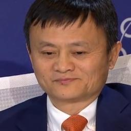

# ReenactGAN: Learning to Reenact Faces via Boundary Transfer

Created by [Wayne Wu](https://wywu.github.io/), [Yunxun Zhang](https://github.com/zyx2012) and [Ren Li](https://github.com/liren2515).


We present a novel learning-based framework for face reenactment. The proposed method, known as ReenactGAN, is capable of transferring facial movements and expressions from an arbitrary person’s monocular video input to a target person’s video. Instead of performing a direct transfer in the pixel space, which could result in structural artifacts, we first map the source face onto a boundary latent space. A transformer is subsequently used to adapt the source face’s boundary to the target’s boundary. Finally, a target-specific decoder is used to generate the reenacted target face. Thanks to the effective and reliable boundary-based transfer, our method can perform photo-realistic face reenactment. In addition, ReenactGAN is appealing in that the whole reenactment process is purely feed-forward, and thus the reenactment process can run in real-time.

## Prerequisites
- Linux
- Python 3
- PyTorch 1.1.0 + CUDA 8.0 (Other versions may also work.)
- Dominate

## Getting Started
### Installing
Clone this repo:

```bash
git clone ...
cd ReenactGAN
```

### Training
The bounday encoder is trained on WFLW and Helen dataset, and both of the boundary transformer and decoder are trained on [CelebV Dataset](https://drive.google.com/file/d/1jQ6d76T5GQuvQH4dq8_Wq1T0cxvN0_xp/view?usp=sharing). The training of the encoder requires a huge amount of time, so you can get the pretrained encoder at *./pretrained_models/v8_net_boundary_detection.pth*. 

To train the boundary transformer, run
```bash
sh script/train_Transformer.sh
```
You need to take care of the arguments **--root_dir** and **--which_target**.  **--root_dir** refers to the directory of the dataset, and **--which_target** refers to which person to be the target
```bash
0: Emmanuel_Macron
1: Kathleen
2: Jack_Ma
3: Theresa_May
4: Donald_Trump
```

To train the decoder, run
```bash
sh script/train_Decoder.sh
```
Also, you need to take care of the value of **--root_dir**, which refers to the directory of the target person.

### Testing
To test the model, run
```bash
sh script/move_models.sh ./checkpoints/Transformer_2019-xx-xx_xx-xx-xx/G_BA_xx.pth ./checkpoints/Decoder_2019-xx-xx_xx-xx-xx/xx_net_G.pth trump
sh script/test.sh
```
The images used for testing is at ./test_imgs/samples/image, and the text file, ./test_imgs/samples/images_list.txt, contains the list of these images. After the testing, you will get a floder named **results**, which contains the images of the real and reenacted faces, the boundaries and the transformed boundaries of the real faces. Here are some results.

&nbsp;&nbsp;&nbsp;&nbsp;&nbsp;&nbsp;&nbsp;&nbsp;&nbsp;&nbsp;&nbsp;&nbsp;&nbsp;&nbsp;&nbsp;**Input** 

&nbsp;&nbsp;&nbsp;**ReenactGAN** 

You can get our trained models from [Decoder](https://drive.google.com/file/d/1MBWABJK9webZxAMvN9Cl5FBhXateppzu/view?usp=sharing) and [Transformer](https://drive.google.com/open?id=1v-8kh0N56alKiSoBAENXp9KNJ0lg_Qtq).
## Citation
If you find ReenactGAN helpful for your research, please cite:
```bibtex
inproceedings{wayne2018reenactgan,
 author = {Wu, Wayne and Zhang, Yunxuan and Li, Cheng and Qian, Chen and Loy, Chen Change},
 title = {ReenactGAN: Learning to Reenact Faces via Boundary Transfer},
 booktitle = {ECCV},
 month = September,
 year = {2018}
} 
```

## Questions
Please contact wuwenyan0503@gmail.com
